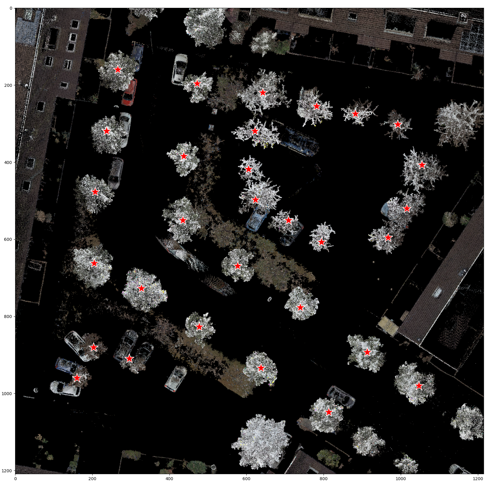

# 🟩 pc_segment
[](https://github.com/Municipality-of-Rotterdam/pc_segment/actions/workflows/main.yml)


A Python package for segmenting objects (e.g., trees) from rasterized LiDAR tiles using the **Segment Anything Model (SAM)**.

This package is designed to work directly with the outputs of [`pc_prep`](https://github.com/Municipality-of-Rotterdam/pc_prep), consuming rasterized point cloud tiles and their corresponding prompt files to produce per-tile segmentation masks and metadata for downstream analysis.

---

<p align="center">
  
  
</p>

*Prompt-based tree segmentation. The red stars show the point prompts, based on tree point geometries processed in `pc_prep`.*


## 📘 Overview

The toolkit provides a reproducible **object segmentation workflow** for 3D point cloud data.
It performs:

* **Prompt-based segmentation** — uses precomputed point prompts from `pc_prep` to guide SAM on tile-level RGB raster images.
* **Batch mask generation** — runs SAM efficiently in mini-batches to segment all tiles in a dataset.
* **Debug visualization** — optionally saves overlays showing prompt points and colorized segmentation masks.
* **Metadata tracking** — maintains a structured JSON manifest (`segment_metadata.json`) linking each point cloud tile to its segmentation mask.
* **Model checkpoint management** — automatically initializes SAM from a specified model checkpoint (`.pth`).

Together, these steps form the **second stage** of the LiDAR-to-segmentation pipeline:

```
Raw LAS/LAZ → Preprocessing (pc_prep) → Raster Tiles + Prompts → Segmentation (pc_segment) → Masked Datasets
```

---

## 🧱 Required Data and Inputs

| Data Type                   | Format          | Description                                                                                          |
| --------------------------- | --------------- | ---------------------------------------------------------------------------------------------------- |
| **Rasterized Point Clouds** | `.tif` / `.png` | Top-down RGB images generated by `pc_prep`. Represent each 50×50 m tile of LiDAR data.               |
| **Prompt Files**            | `.json`         | Point prompts per tile (pixel coordinates + labels) guiding SAM segmentation. Produced by `pc_prep`. |
| **Image Metadata**          | `.json`         | Dictionary mapping each tile to its raster and prompt file (`img_metadata.json` from `pc_prep`).     |
| **SAM Model Checkpoint**    | `.pth`          | Model weights for Segment Anything (e.g., ViT-H checkpoint).                                         |
| **Output Directory**        | folder path     | Folder where segmentation masks and `segment_metadata.json` will be written.                         |

---


*Example point_prompt .json file with prompt pixel coordinates and labels.*

## ⚙️ Environment Setup

To create and activate the environment required for running the segmentation stage:

```bash
conda env create -f environment.yml
conda activate pc_segment
[pip install poetry &&] poetry install
```

This installs dependencies for `segment-anything`, `torch`, `opencv`, and related geospatial packages.

---

## 🚀 Running the Segmentation Pipeline

After preprocessing point cloud tiles with `pc_prep`, you can run segmentation using:

```bash
python src/pc_segment/segment_pc.py \
  --img_metadata PATH/TO/img_metadata.json \
  --img_dir PATH/TO/preprocessed_images \
  --model_path PATH/TO/sam_vit_h_4b8939.pth \
  --segment_dir PATH/TO/output_segmentations \
  --segment_metadata PATH/TO/output_segment_metadata.json \
  --batch_size 2 \
  --overwrite false \
  --debug false
```

### 🧬 Command-Line Arguments

| Argument             | Type                  | Description                                                     |
| -------------------- | --------------------- | --------------------------------------------------------------- |
| `--img_metadata`     | str                   | Path to the `img_metadata.json` file generated by `pc_prep`.    |
| `--img_dir`          | str                   | Directory containing rasterized tile images and prompt JSONs.   |
| `--model_path`       | str                   | Path to the Segment Anything model checkpoint (`.pth`).         |
| `--segment_dir`      | str                   | Output directory for predicted segmentation masks.              |
| `--segment_metadata` | str                   | Output JSON mapping tiles to segmentation masks.                |
| `--batch_size`       | int, default `2`      | Number of tiles to segment in parallel per SAM inference call.  |
| `--overwrite`        | bool, default `false` | If true, overwrite existing segmentation outputs.               |
| `--debug`            | bool, default `false` | If true, create additional prompt and mask visualization files. |

### Example Output Structure

```
segment_dir/
└── filtered_1647_8639/
    ├── nl-rott-230412-7415-laz/
    │   ├── pred_mask.png
    │   ├── debug_prompt_image.png   # optional (debug)
    │   └── pred_mask_debug.png      # optional (debug)
segment_metadata.json
```

---

## 🧠 Internal Workflow Summary

1. **Load Metadata:** The script reads `img_metadata.json` to know which images and prompts to process.
2. **Initialize SAM:** Loads a ViT-H model checkpoint (`sam_vit_h_4b8939.pth`) to GPU (or CPU fallback).
3. **Batch Processing:** Runs segmentation on batches of tiles for speed.
4. **Prompt Application:** Uses per-tile click coordinates and binary labels to guide segmentation.
5. **Mask Output:** Combines SAM masks into a 2D labeled mask (`pred_mask.png`).
6. **Metadata Export:** Writes `segment_metadata.json` summarizing all outputs.

---

## 🤩 Helper Functions

| Function                                | Description                                                                               |
| --------------------------------------- | ----------------------------------------------------------------------------------------- |
| `get_collection_info(pc_filename: str)` | Extracts dataset collection identifiers (e.g., `nl-rott-230412-7415-laz`) from filenames. |
| `show_points()` / `save_image_prompt()` | Utility functions for visualizing SAM prompt locations.                                   |
| `combine_masks()`                       | Combines multiple SAM masks into one labeled mask.                                        |

---

## 📦 Integration with `pc_prep`

`pc_segment` is the **second stage** in the complete LiDAR processing workflow:

| Stage                | Package                 | Purpose                                                                      |
| -------------------- | ----------------------- | ---------------------------------------------------------------------------- |
| **1. Preprocessing** | [`pc_prep`](https://github.com/Municipality-of-Rotterdam/pc_prep) | Filters LiDAR points (CSF, BGT segmentation), generates rasters and prompts. |
| **2. Segmentation**  | `pc_segment`            | Consumes rasters + prompts, runs SAM, outputs mask images.                   |

---

## 🗾️ Citation

This module builds on the [Segment Anything Model (SAM)](https://github.com/facebookresearch/segment-anything).


## 🛠️ License

This project is distributed under the EUPL License.
See [LICENSE](./LICENSE) for details.

## 👥 Authors & Contact

Developed by the **City of Rotterdam** for prompted **object segmentation** from rasterized LiDAR datasets.